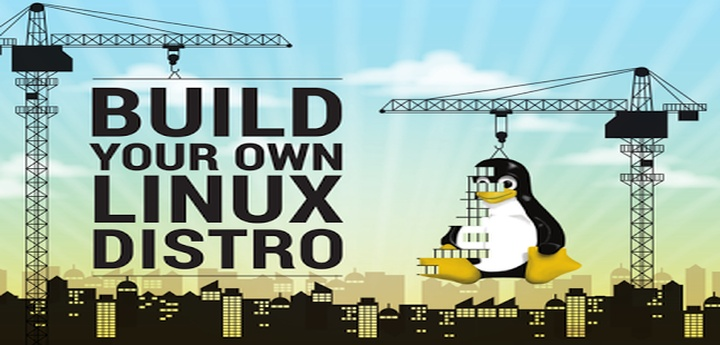

# Linux From Scratch  

  

## About The Linux From Scratch Project
Linux From Scratch (LFS) is a project that allows you to create your own Linux Distribution. Most modern Operating Systems come with pre-compiled packages that make it function properly. Windows, macOS, and Ubuntu all follow this strategy. The idea is that after you install the OS, it works right away. The user does not have to worry about efficiency or customization, as long as "it just works." This model is known as The Point Release Development Model. It comes at the advantage of convenience and having a stable system intended for the average user. But this model also comes at the cost of freedom, speed, and not having the latest software. In the Rolling Release Model, you have the freedom to choose software that fits your preference. When you build an OS from scratch, you install only the software you want. This makes the system a lot faster because it doesn't have to devote RAM and Storage to an application you can't uninstall. The last issue with the Point Release Development Model is that packages are not released until the latest version of the OS is updated, on average this takes about six months for the package to reach the user. In the Rolling Release Model you get the package as soon as the new version is released. This is useful because the user doesn't have to wait on the OS for a package update.            

## Why Linux From Scratch?  
I have had such a great experience using Arch Linux and want to go beyond a minimalist Linux distribution. Arch and LFS are both rolling release but differ from the fact that in LFS you have to build the packages from source. Arch uses a package manager, so you either download the package from the Official Arch Repository using the `pacman -S [name of package]` command or from the Arch User Repository (AUR) using the `yaourt [name of package]` command. Building a package from source requires the user to manually download the package and configure it to work on the system. This takes A LOT more work. LFS is the next step towards a deeper level of understanding of Linux. By building this Operating System from scratch, the developer will get a better sense of the internal workings of Linux. If you love Linux, this is definitively a good project to be a part of. This project should take a couple weeks to complete the first version.

## Change Log

### 2018-02-03: Building GCC
- Using multithreading to build packages
- Compiled GCC
- To Do: run makefile for GCC

### 2018-02-02: Building Binutils
- Patched the packages 
- Today I worked with installing the Binutils package on my Linux Distribution. The Binutils package contains a linker, an assembler, and other tools for handling object files. I will need to be taking note of the time it takes to build this package. The package build time will be measured in Standard Build Units (SBU). An SBU is a measure the time it takes to build the binutils package from the configuration. The approximate build time on my system was roughly around 4:07 Minutes. This build time was unacceptable for the specs on my system.
- I realized that there were two issues when building the Binutils package. It wasn't being optimized for x86 architecture and it was only being built on one core 
- To optimize the build for x86, a symbolic link was created to ensure there would be no issues with the toolchain. 
- I found a command to rebuild the system with 4 cores, this dramatically decreases build time. 

### 2018-01-10: Partition
- Obtained an external usb drive to create the partition
- Created the partition
- Created file system for the partition
- Writing super blocks and file system accounting information to external USB (8GB)
NOTE: THESE COMMANDS NEED TO BE EXECUTED EVERYTIME THE SYSTEM RESTARTS
1. Exported the LFS variable
  `export LFS=/mnt/lfs`
  `echo $LFS`
2. Create Directory
  ` mkdir -pv $LFS`
3. Mount drive as an ext4 onto the directory
  `sudo mount -v -t ext4 /dev/sdb $LFS`
END OF COMMANDS
- Downloaded the necessary packages and patches from site
`wget http://www.linuxfromscratch.org/lfs/view/stable/wget-list`
- Created The Linux From Scratch Tools Directory
- Created a user for the LFS distro on the host system.
This is to prevents any leaks from the host system into the build environment.
- Set up the working environment!

## NOTE
I've been having issues uploading all the files to GitHub, the files seem to be to large. The Linux from scratch distro was originally located inside the lfs directory. I'm thinking about either hosting the LFS distro on another GitHub alternative or on my local server. 

## Potential Names for This Distro
  - Desert Linux
  - Arizona Linux
  - Desert Digital OS
  - Jones Linux
  - Salsa Linux (I really like Salsa)
  
## Automatic Compilation in C
`watch "gcc test.c" && ./a.out"`

`Ctrl + z` pause compilation

`fg` continues compilation
